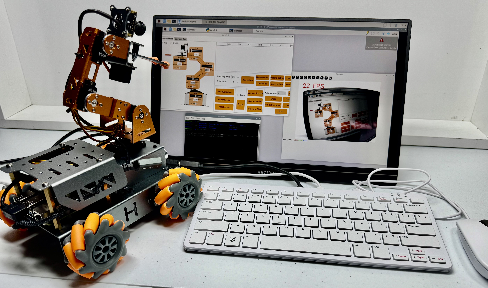

# Pathfinder2026

**Summer 2026 Pathfinder robotics event**

**Last Updated:** July 25, 2026

Pathfinder2026 is the event repo for the 2026 Pathfinder robot workshop. Participants should use this page as the starting point.

The workshop flow has three phases:

1. Assemble
2. Capabilities Exploration
3. Course Challenge

## Start Here

If you are at the event, work through the three phases in order:

1. [Phase 1: Assemble](docs/workshop/ASSEMBLE.md)
2. [Phase 2: Capabilities Exploration](docs/workshop/CAPABILITIES_EXPLORATION.md)
3. [Phase 3: Course Challenge](docs/workshop/COURSE_CHALLENGE.md)

For the workshop, the Pi 500 and robot images should already be created. The OS build documents are for facilitators preparing equipment before the event.

## Need Help?

Use these when a phase tells you to, or when something is not working:

| Need | Guide |
|------|-------|
| Troubleshooting | [Student troubleshooting](docs/support/TROUBLESHOOTING.md) |
| Code, connection, and update help | [Support index](docs/support/README.md) |
| Battery safety | [Battery safety](docs/support/BATTERY_SAFETY.md) |

Preparing equipment before the event? Use the [setup index](docs/setup/README.md).

## License

MIT License. See [LICENSE](LICENSE).
