# robot Assembly Guide

**Phase 1: Assemble**

**Purpose:** Unpack and assemble the robot while another teammate sets up the Pi 500.

This guide is for the event table. The robot image should already be created before the event.

## Materials

- robot kit
- Charged batteries
- Camera
- Sonar sensor
- Arm and gripper parts
- Small tools needed for the kit

## Step 1: Unpack

1. Lay out the chassis parts.
2. Keep small screws and brackets in one place.
3. Keep wires away from the edge of the table.
4. Do not install batteries until the robot is mechanically assembled.

## Step 2: Chassis

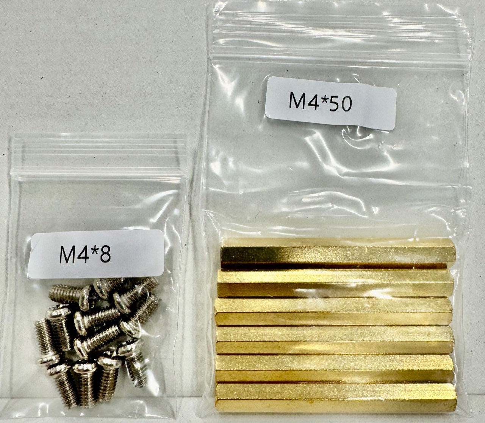

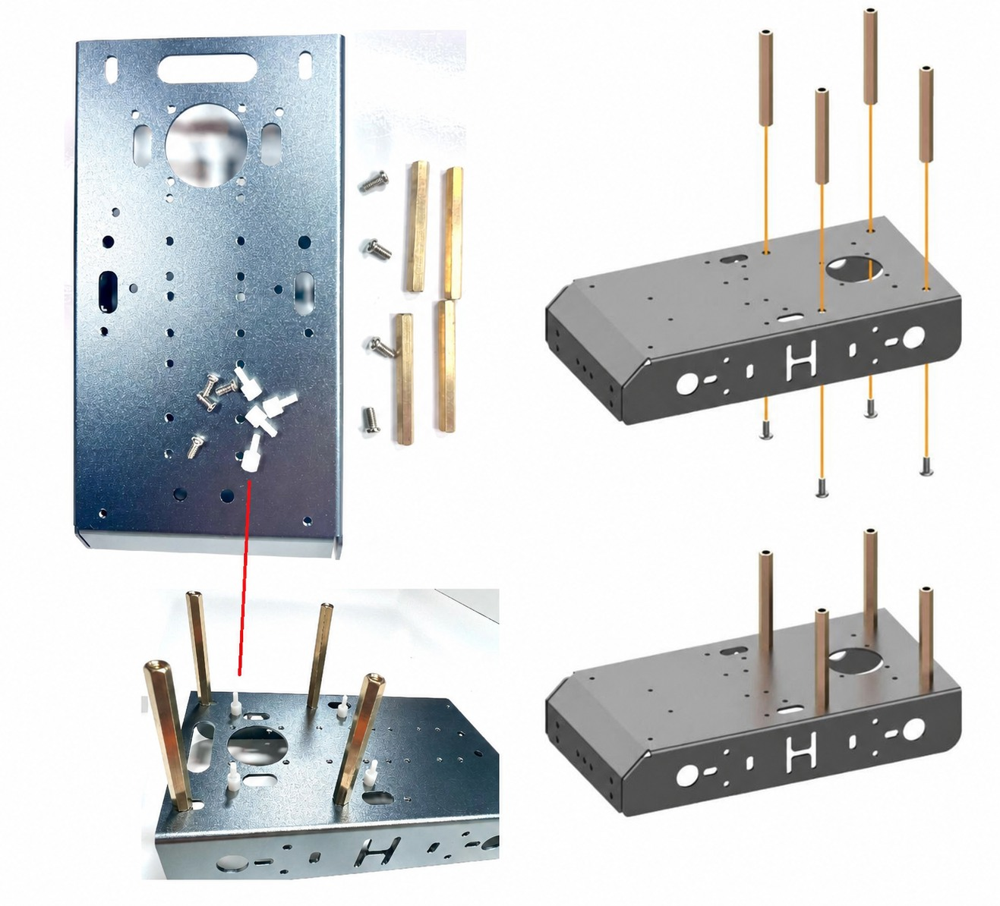

1. Assemble the lower chassis.
2. Find the `M4*50` standoffs and `M4*8` screws.
3. Add the standoffs.
4. Keep access to the battery compartment and power switch.

## Step 3: Motor Assembly

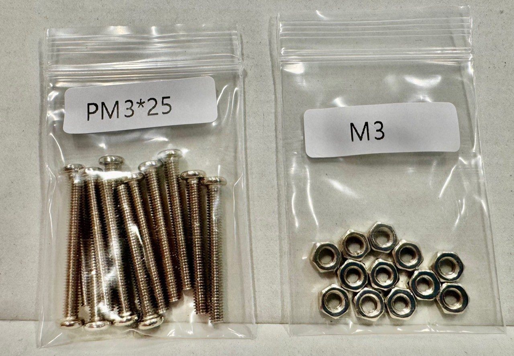

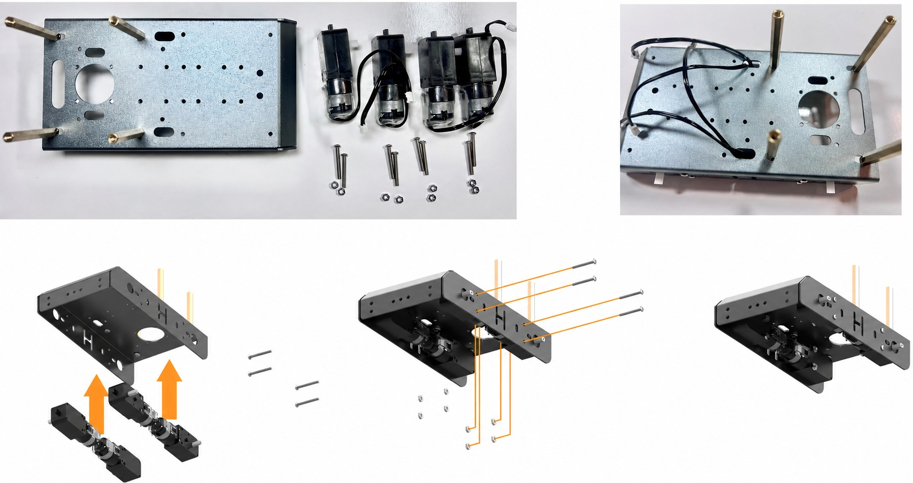

1. Find the `PM3*25` screws and `M3` nuts.
2. Mount the motor brackets.
3. Route motor wires through the side opening so they cannot touch the wheels.
4. Check that each motor is secure before installing wheels.

## Step 4: Wheel Hub Inserts

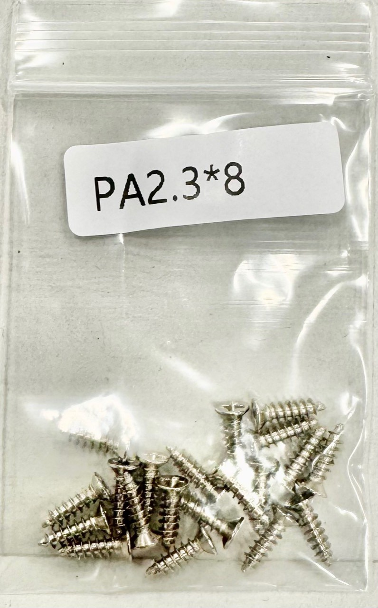

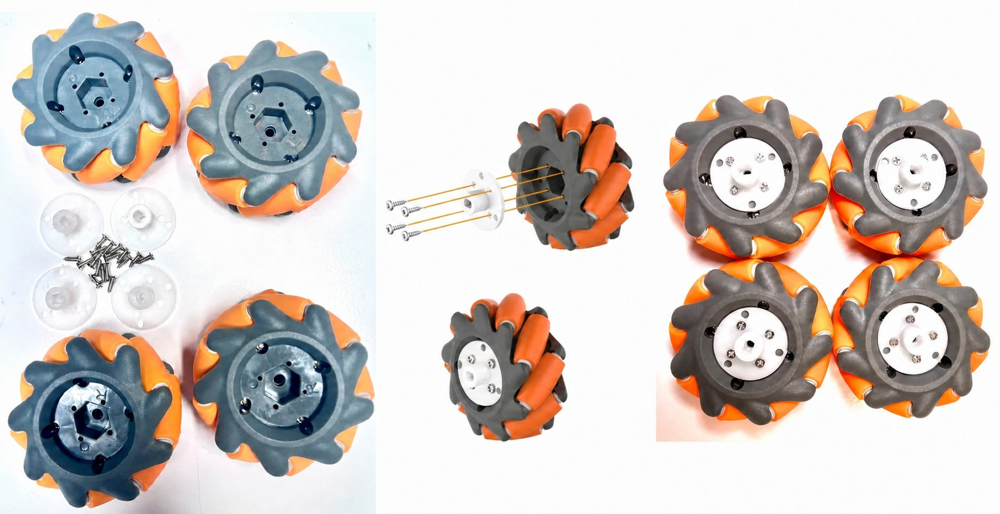

1. Find the `PA2.3*8` wheel screws.
2. Attach the white hub inserts to the mecanum wheels.
3. Confirm each white hub insert is seated flat.
4. Confirm the roller directions are mirrored correctly from left to right.

## Step 5: Attach Mecanum Wheels

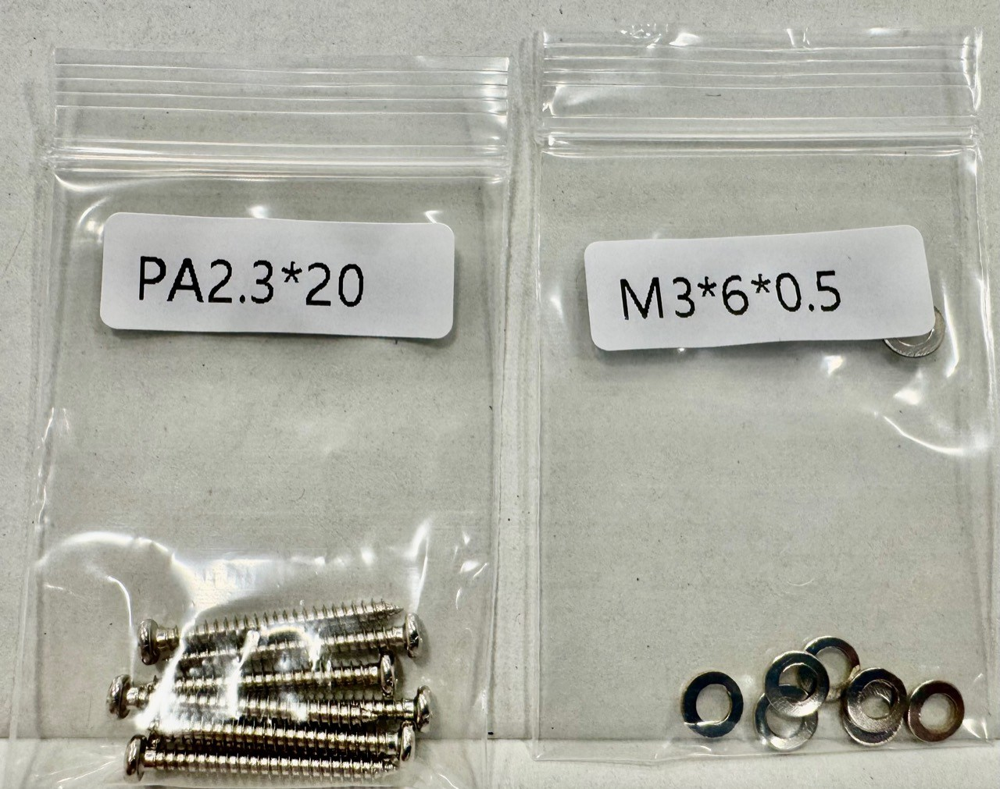

1. Find the `PA2.3*20` screws and `M3*6*0.5` washers.
2. Attach all four mecanum wheels to the motors.
3. Spin each wheel by hand and check for rubbing.
4. Make sure wheel screws are tight before powered driving.

## Step 6: Battery Holder

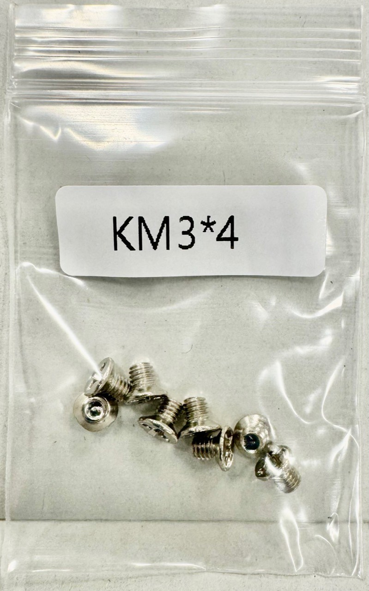

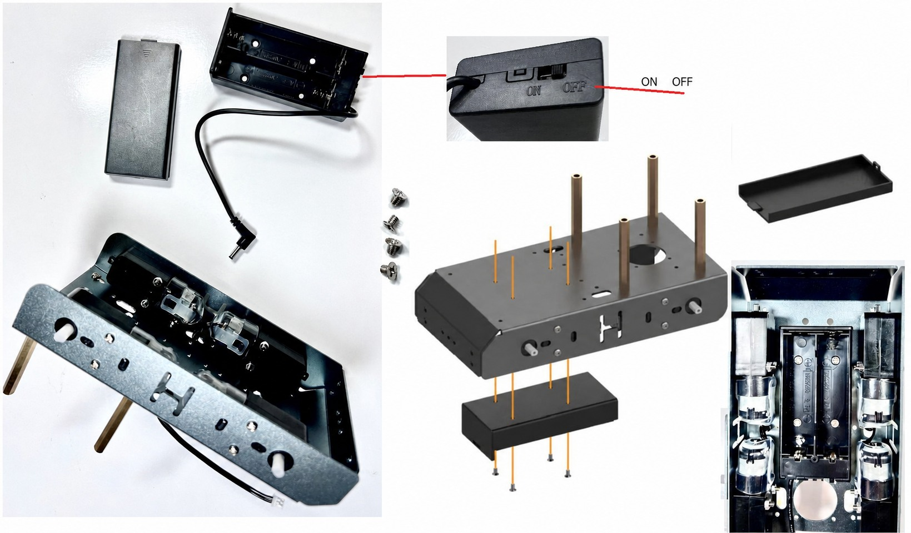

1. Find the `KM3*4` screws.
2. Attach the battery holder.
3. Note the `ON/OFF` marking on the battery holder.
4. Keep the battery holder switch in the `OFF` position.
5. Do not install batteries until the robot is mechanically assembled and ready for the final cable check.

## Step 7: Arm And Gripper

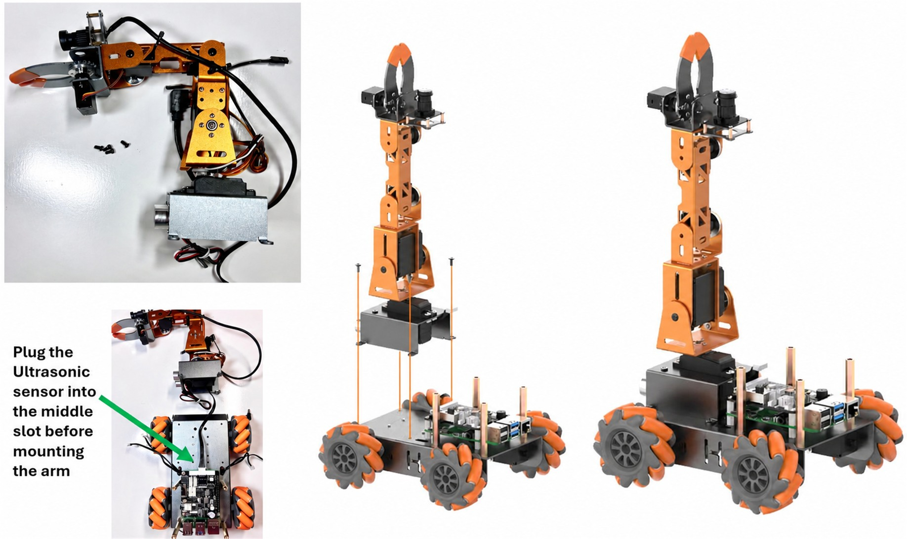

1. Attach the arm base to the robot.
2. Attach shoulder, elbow, wrist, and gripper assemblies.
3. Move the arm gently by hand before powering servos.
4. Check that the gripper can open and close without hitting the chassis.

## Step 8: Camera And Sonar

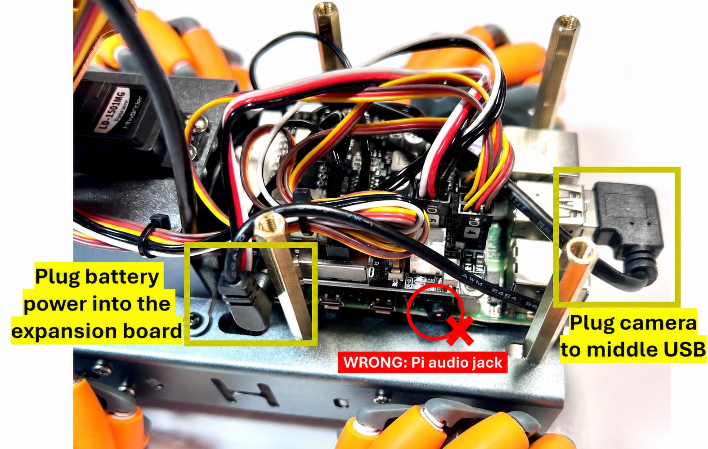

1. Mount the camera where it can see the floor in front of the robot.
2. Keep the camera cable away from wheels and arm joints.
3. Mount sonar facing forward and level.
4. Make sure sonar is not blocked by the arm, camera, or team-built storage.

## Step 9: Battery And Cable Check

1. Confirm the battery holder switch is `OFF`.
2. Install charged batteries.
3. Confirm no cable can touch a wheel.
4. Confirm no cable can snag on the arm.
5. Do not drive until the connect/test battery check passes.

## Step 10: Covers And Final Notes

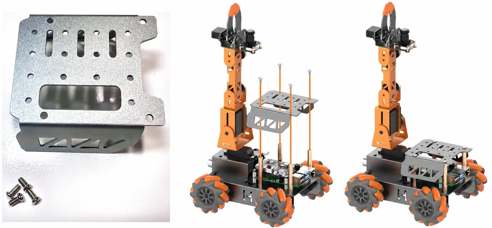

1. Attach the top cover after wiring is checked.
2. If the event build uses a micro HDMI cable, route it cleanly and secure it to the side.
3. Extra screws are normal. Keep them in the team parts container.
4. The cooling fan shown in some older kit photos is not needed for this event build.

## Ready For robot Pi WiFi Setup In Phase 1

The robot assembly path is ready for robot Pi/WiFi setup when:

- Chassis is assembled.
- Wheels spin freely by hand.
- Arm and gripper move without binding.
- Camera and sonar are mounted.
- Batteries are installed and safe.
- Power switch is accessible.

Next: [robot Pi WiFi Setup](../setup/ROBOT_PI_WIFI_SETUP.md)
